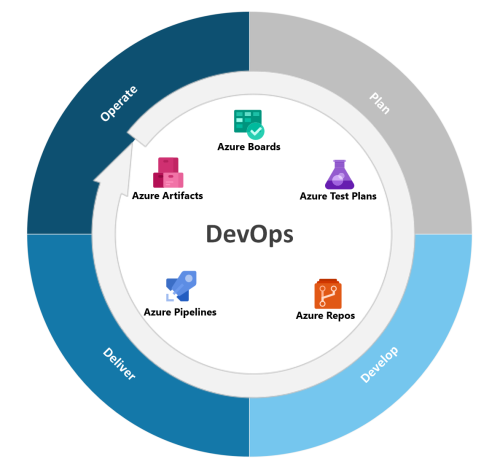

# 🔷☁️ Azure

## Conceitos
### Planejamento e gerenciamento de projetos
- Projeto é um conjunto de atividades temporárias realizadas em grupo, destinadas a produzir um produto, serviço ou resultado único.
- Gestão de projetos é o conjunto de conhecimentos, habilidades técnicas e ferramentas utilizadas para planejar, executar e moniorar um projeto.
- É importante planejar, gerenciar e monitorar a saúde de um projeto.

### Fases
- 1. Inicialização (Sprint 0) - verificar a necessidade de resolução de problema e sua viabilidade
- 2. Planejamento (Definir Épico) - definir metas a serem entregues, sem detalhar
- 3. Execução (Definir Sprintes) - início do desenvolvimento do projeto e etapas para conclusão do produto
- 4. Monitoramento - monitorar custos, entregas e relações pessoais
- 5. Encerramento - análise macro do que está acontecendo de forma retrospectiva, analisando pontos positivos e negativos 

### Azure DevOps
- Software para planejamento e gerenciamento de projetos (repositorios, testes)
-Serviços: Boards, Pipelines, Repos, Test Plan e Artifacts

Microsoft Azure é uma plataforma de computação em nuvem da Microsoft que oferece uma ampla gama de serviços, como máquinas virtuais, bancos de dados, redes, análise de dados, inteligência artificial e mais. 

## 📌 Hierarquia
- 🗻 Epics – Iniciativas grandes e estratégicas (meses).
- 🧩 Features – Funcionalidades grandes ou blocos de valor que compõem o épico (semanas).
- 📜 User Stories (ou Product Backlog Items, se estiver no modelo Scrum) – Descrições menores de requisitos ou funcionalidades específicas para o usuário.
- ✅ Tasks – Atividades individuais e técnicas necessárias para implementar uma user story. [Active e Closed]
- 🐞 Bugs – Itens para registrar e corrigir defeitos (podem estar ligados a qualquer nível acima, mas normalmente associados a user stories ou features). [Active, Resolved e Closed]

Epics
 └── Features
      └── User Stories / PBIs
           └── Tasks
           └── Bugs

