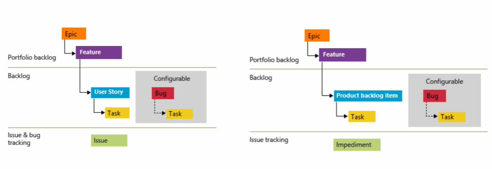
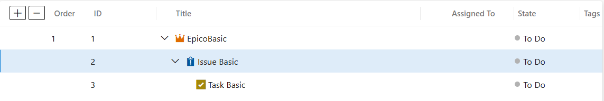
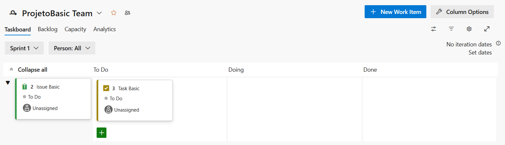
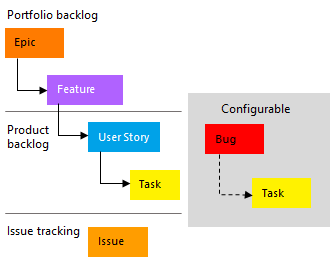
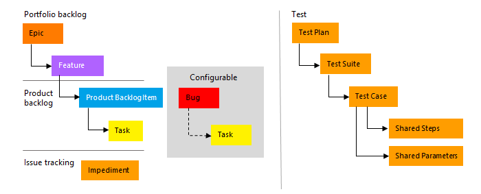
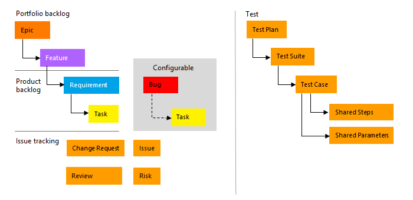

# 🔷☁️ Azure Boards

## Visão Geral
- Serviço responsável pelo Planejamento e Gerenciamento de projetos
- Rastrear e visualizar o que está acontecendo nos times
- Buscar previsibilidade (número de tarefas, período de entregas)
- Medir esforços (o que cada um está entregando e em quanto tempo)

## Templates de processos
- Basic
- Agile
- Scrum
- CMMI

Podem ser personalizados de acordo com a organização e serviços

## Principais Features
- Backlog -> planejamento do projeto, adicionando histórias ou requisitos do usuário ao backlog do produto
- Sprints -> divisão do release em etapas a serem entregues conforme priorização
- Taskboards -> implementação customizada de Kanban conforme necessidade
- Planejamento -> estruturação de todas as iterações do escopo do projeto
- Estimativa -> avaliação dos work items de Story Points em horas de esforço, buscando medir produtividade
- Burndown -> visualização do andamento da equipe (acima ou abaixo de um threshold), medindo saúde da Sprint
- Dashboard -> visualziar de maneira rápida o andamento das Sprints, acompanhando o trabalho realizado em painel
- Wiki -> integração

## Organizações e projetos
- Uma organização é usada para conectar grupos de projetos relacionados, assim ajudando a expandir sua empresa -> Conta GitHub, corporativa ou de instituição de ensino
- Azure Active Directory (AD) conecta automaticamente à sua organização
- Cada organização pode ter inúmeros projetos

## Modelos de processos
- Estrutura que defini como as tarefas e atividades são gerenciadas em um projeto de desenvolvimento de software 
- Como um plano ou conjunto de diretrizes que ajudam a organizar o trabalho e acompanhar o progresso, garantindo que as etapas necessárias sejam concluidas

### 🟦 Modelo Basic
- Simplificado, porém limitado
- Ideal para equipes iniciantes
- Epic -> Issue -> Task

- To do | Doing | Done (por padrão)

### -----------------------------------
### ⚡Modelo Agile
- Indicado para quem utiliza metodologias, princípios e padrões ágeis
- Possui métodos de planejamento (incluindo Scrum)
- Por padrão, os bugs, atividades e testes são rastreados por nível de tarefas, podendo ser configurado

- New | Active | Resolved | Closed | Removed

### -----------------------------------
### 🔄 Modelo Scrum
- Ideal para equipes que seguem o Scrum
- Tarefas controlam apenas o trabalho restante
- Muito bom para rastreio de Product Backlog Items (PBIs)

- New | Approved | Commited | Done | Removed

- To do | In progress | Done | Removed (por padrão)

### -----------------------------------
### 📈 Modelo CMMI
- Extende o modelo Agile com mais planejamento formal
- Requisitos, mudanças e riscos podem ser rastreados

- Proposed | Active | Resolved | Closed

