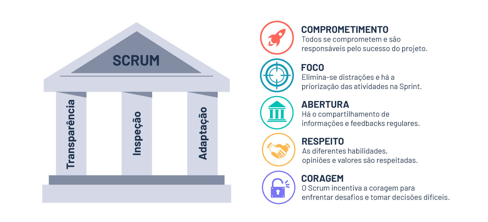

# 🔷☁️ Azure Boards

## Metodologia SCRUM
Framework simples para gerenciamento de projetos complexos, estando no dia a dia do desenvolvimento de produtos
- Trabalhamos como uma ferramenta capaz de controlar nosso trabalho, gerando poder às equipes em busca da meta

### 🏛️ Pilares do SCRUM
- Transparência: apresentar os fatos como eles são, sem maquiar
- Inspeção: monitorar para conseguir melhorar (processos, práticas e pessoas)
- Adaptação: continuamento melhorar, adaptando de acordo com o processo e contexto

### 🔧 Framework SCRUM

1. Product Backlog (funcionalidades)
-------------------------------------

2. Sprint Backlog (entregas incrementais)
- Definida na reunião de planejamento
- As prioridades são definidas pelo Product Owner (P.O.)
- Funcionalidades são então transferidas do Porduct Backlog para o Sprint Backlog
-------------------------------------

3. Ciclos de desenvolvimento - Sprints (semais, quinzenais ou mensais)
- Para o desenvolvimento da funcionalidade, pode-se ter inúmeras Sprints e também maiores divisões (Releases)
- As reuniões de alinhamento e atualização são chamadas de Daily - comunicação

### 👤 Papéis
1. Product Owner (PO)
- Responsável por maximizar o valor do produto.
- Define e prioriza o Product Backlog (lista de funcionalidades e requisitos).
- Representa os interesses dos stakeholders (clientes, usuários, negócio).
- Deve garantir que o time entenda bem os itens do backlog.
-------------------------------------

2. Scrum Master (SM)
- Atua como um facilitador do time.
- Garante que o Scrum seja compreendido e aplicado corretamente.
- Remove impedimentos que atrapalham o progresso da equipe.
- Protege o time contra distrações externas.
- Trabalha para a melhoria contínua do processo.
-------------------------------------

3. Developers (Time de Desenvolvimento)
- Grupo multidisciplinar responsável por entregar o incremento do produto a cada Sprint.
- Planeja o Sprint Backlog (o que será feito dentro da Sprint).
- Se auto-organiza: não recebe tarefas “de cima”, o próprio time decide como realizar o trabalho.
- Garante a qualidade técnica e funcional do produto.

### 📦 Minimum Viable Product (MVP)
Versão reduzida/resumida de um produto
- Projetado para que a visão e estratégia do produto estejam alinhadas às necessidades do mercado