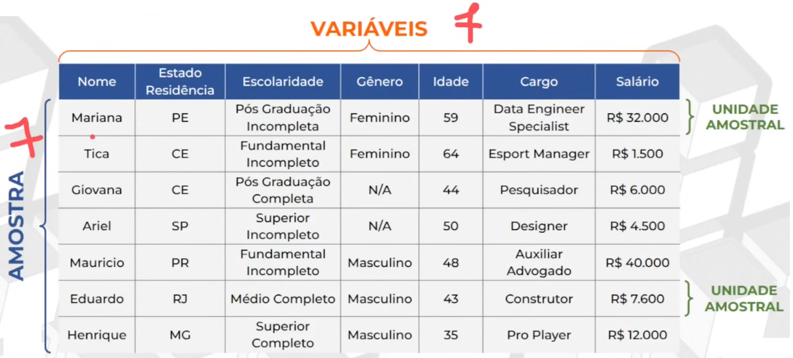

# Tutorial sobre Estatística
## 🧮 O que é?
- Informações que podemos obter de um volume de dados que as resume e define (quantidade, proporções) -> Uma maneira de sumarizar/resumir!

## 👥 População e amostra
Os dados podem ter origem de: 
- Uma população (o todo)
- Uma amostra (uma parte da população, que pode ou não ser representativa. O ideal é que se aproxime ao máximo da representativiade da população)

### Amostragem aleatória
- Método de seleção em que todos os elementos da população têm a mesma probabilidade de serem escolhidos, garantindo imparcialidade e representatividade na amostra.
- O ideal é que as informações coletadas sejam independentes entre si.

### Diferença entre Parâmetro e Estimador

| **Aspecto**          | **Parâmetro**                                              | **Estimador**                        |
|----------------------|------------------------------------------------------------|--------------------------------------|
| **Definição**         | Descreve uma característica (medida) do conjunto de dados  | Estimativa de um parâmetro           |
| **Conjunto de dados** | População                                                  | Amostra                              |
| **Valor**             | Fixo (normalmente desconhecido)                            | Calculado e aleatório 

- Parâmetro -> verdadeiro valor
- Estimador -> estimativa do verdadeiro valor
- Unidade amostral -> cada pessoa/objeto que faz parte da amostra
- Variáveis/características -> informações da unidade amostral (gênero, idade...)

## 🔣 Tipos de variáveis

- Nominal -> texto sem ordem (Ex. cor)
- Ordinal -> texto com ordem (Ex. formação)

- Discreta -> números inteiros (Ex. filhos)
- Contínua -> números flutuantes (Ex. peso)

