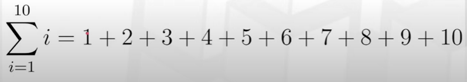
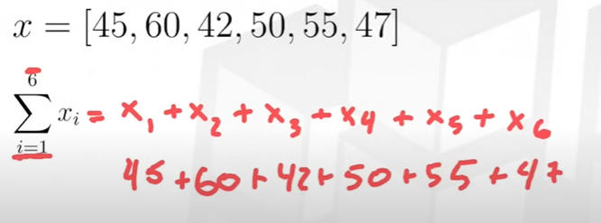
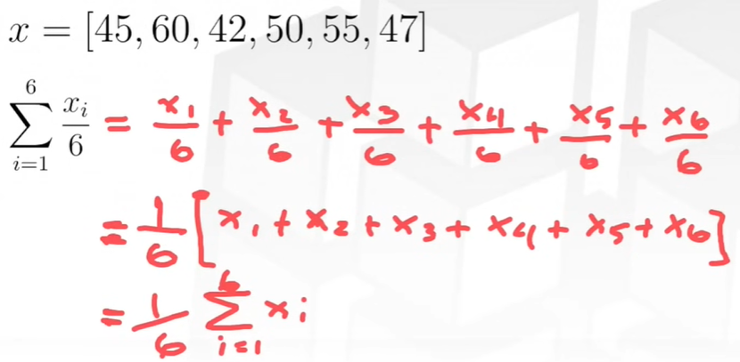
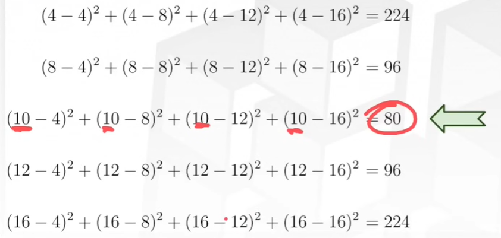
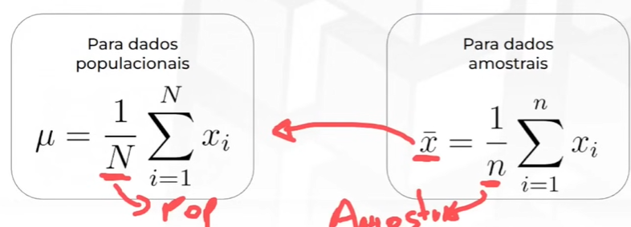
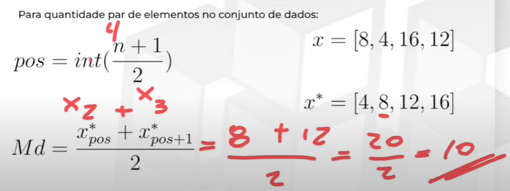
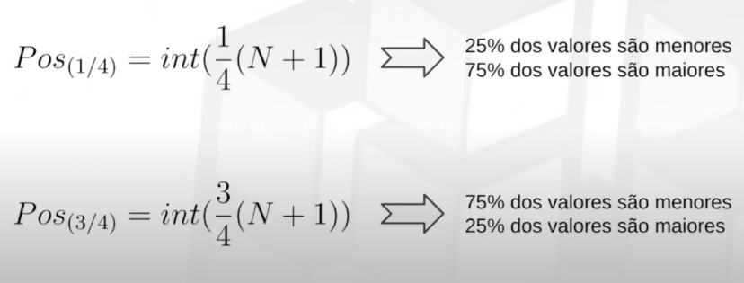
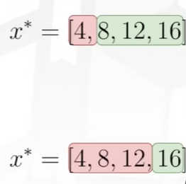

# Tutorial sobre Estatística
## 📏 Medidas de resumo (estatísticas descritivas)
- Valores que resumem e descrevem um conjunto de dados de forma consisa, permitindo uma compreensão mais rápida e fácil das suas características centrais e distribuição.

### Tabela de frequência (qualitativo)
- Utilizadas nas variáveis qualitativas (Ex. nome, gênero)
- Conseguimos identificar quanto cada nível ou valor da variável ocorre e sua representação em todo conjunto de dados

Frequência absoluta -> quantas vezes o nível da categoria aparece no dataset (contagem). Podemos acumular, incrementar
- Cor = marrom (n = 10)
- Cor = azul (n = 12)
- Cor = vermelho (n = 15)

Freqência relativa -> maneira de relativizar a frequência absoluta por meio dos totais (proporção/taxa - padronizar).
Podemos acumular, incrementar
- Total = 37
- Marrom (10/37)
- Azul (12/37)
- Vermelho (15/37)

### Medidas de posição (quantitativo)
#### Somatório
- Somatorio (∑ (sigma maiúsculo)) -> operação matemática usada para somar uma sequência de valores, associada a observações de uma variável.

#### Média
- Média -> medida de tendência central que representa o valor "típico" ou "central" de um conjunto de dados numéricos. É o ponto mais próximo de todos os outros pontos.

Média populacional (μ) - dados de uma população

Média amostral (x̄) - estimador da média populacional

#### Mediana (Q2)
- Mediana ->  medida de tendência central que representa o valor central de um conjunto de dados ordenados. Ela divide os dados em duas metades: 50% dos valores estão abaixo da mediana e 50% estão acima.

- Conjuntos simétricos => Média e mediana parecidas
- Conjuntos assimétricos => Média e mediana diferentes

#### Quartis (Q1 e Q3)
- Quartil 1 -> Representa o valor abaixo do qual estão 25% dos dados.
- Quartil 3 -> Representa o valor abaixo do qual estão 75% dos dados.

- Intervalo interquartílico (IQR) -> Mede a dispersão dos dados entre os quartis centrais (50% do conjunto)

IQR = Q3 − Q1

- Extremos -> Os pontos de mínimo e pontos de máximo são tipos de extremos locais de uma função. Eles indicam onde a função atinge valores mínimos ou máximos, em um determinado intervalo.