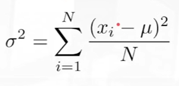
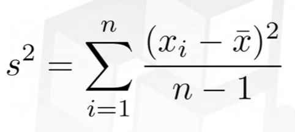
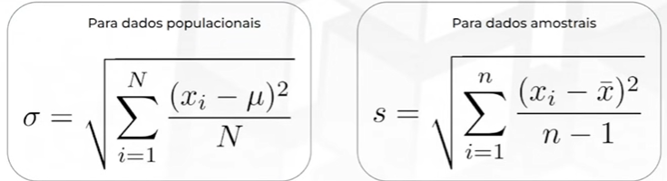

# Tutorial sobre Estatística
## 📏 Medidas de disperssão (estatísticas descritivas)

### Variância (σ²)
- Média -> menor valor da soma de todas as distâncias

- Variância (σ²) -> menor valor da soma de todas as distâncias dividido pelo núemero de distâncias (média da média)

-> Se o valor for muito alto, os pontos estão, em média, variando bastante da média!

Variância populacional:

Variância amostral:

### Desvio padrão (σ)
- Raiz quadrada da variância
- Mantém a unidade, para se poder avaliar e interpretar

### Amplitude
- Diferença entre o máximo e o mínimo
- Representa a distância dos extremos

VAR = MAX - MIN