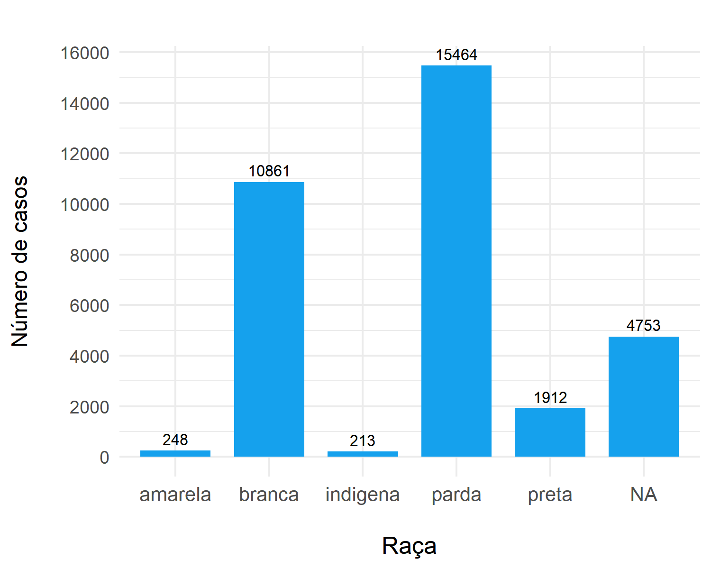
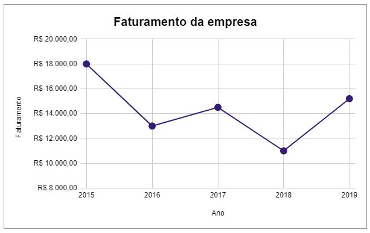
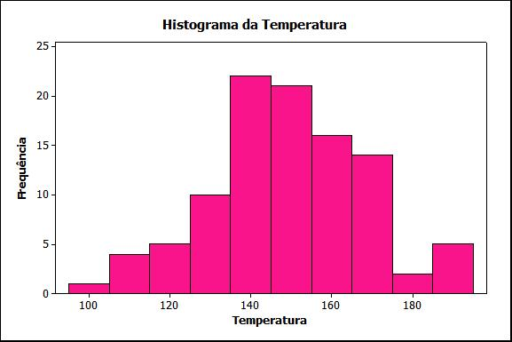
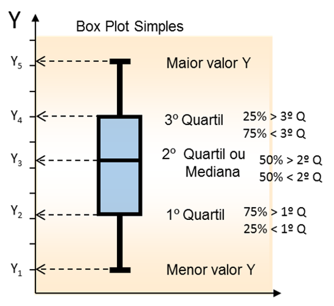
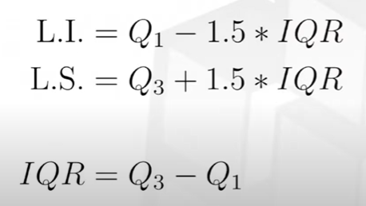
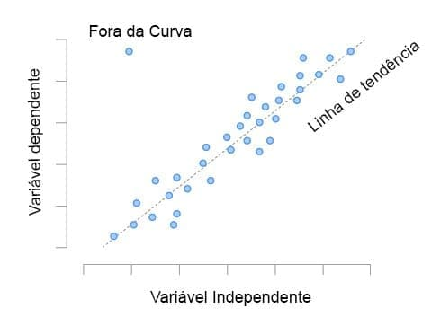

# Tutorial sobre Estatística
## 📊 Gráficos
- Forma visual de representar métricas estatísticas

## Gráfico de barras
- Tipo de visualização de dados usado para comparar valores entre diferentes categorias, demosntrando suas semelhanças e diferenças
- Busca representar visualmente uma tabela de frequências

#### Eixo X - variável qualitativa
#### Eixo Y - quantidade ou frequência de cada categoria da variável
(Os eixos podem se inverter)

## Gráfico de linhas
- Utilizado para séries históricas
- Cada ponto é conectado por linhas

#### Eixo X - data como variável quantitativa
#### Eixo Y - quantidade ou frequência de cada categoria da variável

## Gráfico de histograma
- Representação da agrupação de valores de uma variável quantitativa
- É possível identificar a distribuição dos dados (probabilidade)

#### Eixo X - variável quantitativa agrupada
#### Eixo Y - quantidade ou frequência de cada categoria da variável

- Como definir a quantidade de bins (intervalos):

## Gráfico de boxplot
- Forma de  resumir a distribuição de um conjunto de dados numéricos, representando: valor mínimo, quartis, valor máximo e outliers

- Como calcular os limites e o intervalo:

- Valores acima do LS ou abaixo do LI são considerados Outliers

## Gráfico de dispersão
- Associação entre 2 variáveis
(gráfico bivariado)

- Busca avaliar associação entre as variáveis

Exemplo: correlação de Pearson (linear)

