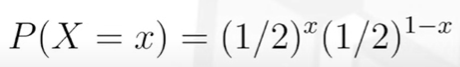
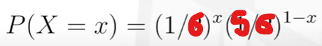
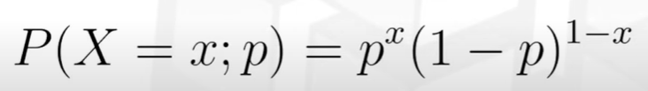
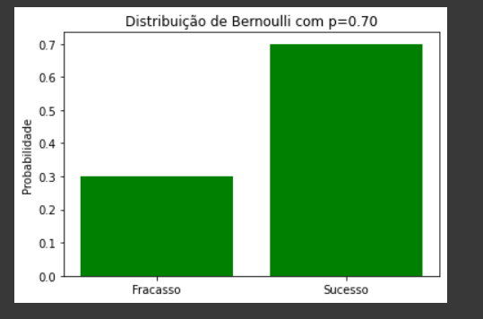
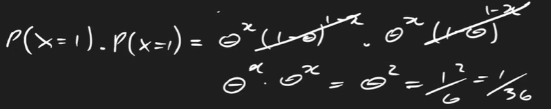
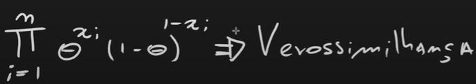

# Tutorial sobre Estatística
## 🎲🎲 Distribuição de probabilidade
### Lançamento de uma moeda
- X = [0 - cara, 1 - coroa]
1) P(X = 0) = 1/2
2) P(X = 1) = 1/2

### Lançamento de um dado de 6 lados
1) P(X = 0) [qualquer outro dado] = 5/6
2) P(X = 1) [sair 6 no dado] = 1/6

### Logo, Ditribuição de Bernoulli
- Evento de interesse dicotônico (ser ou não ser)

### Agora, como descobrir a probabilidade associada (p)?
- Para eventos independentes, multiplica a equação pelo número de unidades amostrais.

Exemplo: Jogando o dado 2 vezes, qual a probabilidade de tirar 6 nos dois lances?

- Para n eventos:

Verossimilhança é a probabilidade conjunta de observar o que observei no momento de coletar os dados!

