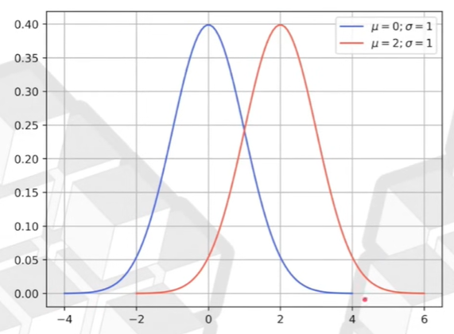

# Tutorial sobre Estatística
## 🎲🎲 Distribuição de probabilidade normal
- Possui 2 parâmetros: μ (mi) e σ (sigma)

Mexer nos parâmetros muda a curva:

- μ (mi) muda a posição

- σ (sigma) muda o formato

## Como encontrar o melhor ajuste? 
### μ e σ
- A média amostral é o melhor estimador de μ (mudança na posição)
- O desvio padrão é o melhor estimador de σ (mudança no formato)

Ambos são estimadores pontuais, ou seja, podem mudar a depender da amostra coletada. 

### Intervalo de confiança
- Podemos criar estimadores intervalares (podem estar entre esses valores)
- O intervalo de confiança é uma região onde acreditamos que o verdadeiro valor se encontra, com base em uma probabilidade associada
- Para cada amostra que retiramos a partir da população, temos uma chance (probabilidade) de cobrir o verdadeiro valor, com base na variabilidade

-> Quanto maior o σ (variabilidade), mais amostras serão necessárias para se alcançar o intervalo de confiança 

(maior σ => maior IC | menor σ => menor IC)

### ---
- Aproximadamente 2σ me da 95% de todas as ocorrências (-2σ até +2σ) -> isso significa que, em uma distribuição normal, cerca de 95% dos valores estão dentro de dois desvios padrão (σ) da média (μ).

### Exemplo:
1) Uma campanha de marketing gerou um ticket médio de R$155,00 e um desvio padrão de R$27,00, com 50 usuários.
Se a campanha fose feita para toda a base amostral, qual seria a expectativa de receita por pedido, considerando 95% de confiança estatística?

- Média amostral = 155
- Desvio padrão amostral = 27
- n = 50
- μ = ?

IC = Média am. ± t(α/2; n-1) * (DP am./ raiz de n)

-> Para n-1 (49) graus de liberdade, o t(α/2) = 2,009

IC = 155 ± 2,009 * (27/7,07)

IC = 155 ± 7,67

- Tenho 95% de certeza que a média populacional se encontra nessa faixa:

147,32 ≤ IC ≤ 162,67
