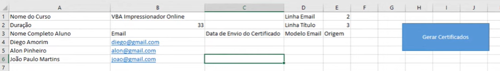
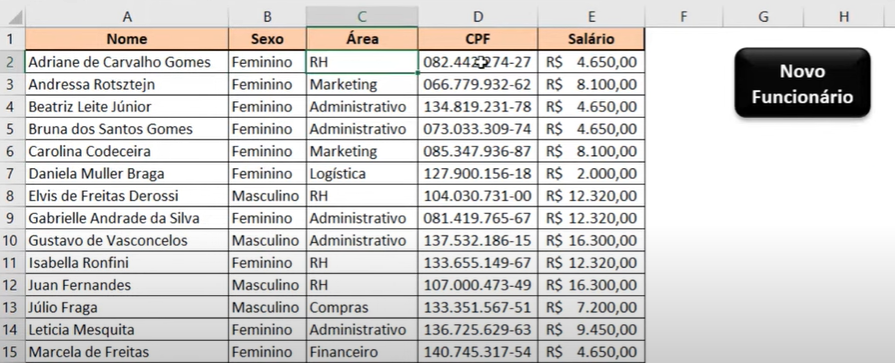

# Tutorial sobre VBA
## 🖥️ O que é?
- Visual Basic for Applications (VBA)
- Linguagem de programação da Microsoft aplicada ao pacote office
- Muito utilizado para automações

### Macros
- Códigos escritos em VBA

## Exemplos:
- Envio de certificados automaticamente por e-mail:

- Criação de formulários:

## 🖥️ Comu utilizar
- Para abrir o ambiente em VBA no excel digite: 

ALT + F11 

ALT + FN + F11

- 