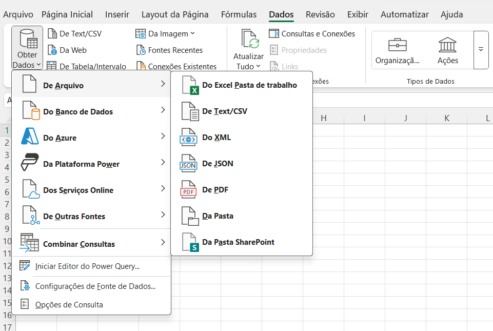
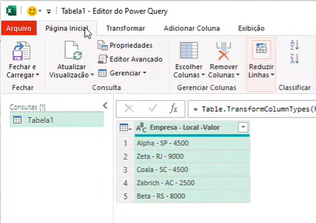
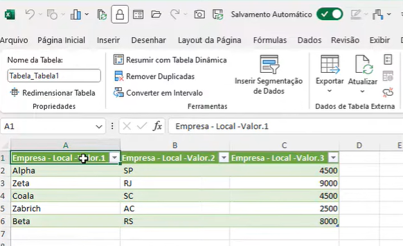
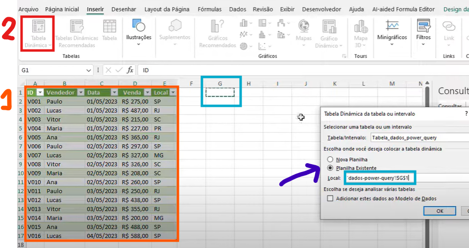
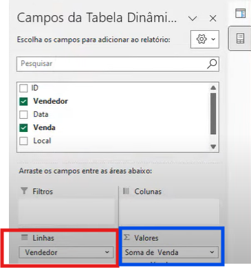
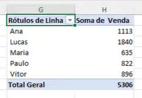

# Tutorial sobre Power Query
## 🧮 O que é?
- Está presente desde a versão de 2013 do Excel
- Utilizado para fazer consultas em tabelas (super consultas) adados que estão externamente/internamente na planilha, manipulando para gerar uma tabela necessária.
- É possível agregar/ atualizar os registros automaticamente e definir um tempo de atualização.

## 🧑‍💻 Como utilizar?
- É possível puxar dados de diversas fontes:

- Após obter os dados, utiliza-se o editor do Power Query:

- Quando ele carrega, você gera uma consulta dos dados:

- Atualização:

### -----------------------
### Com tabela dinâmica:
- Início:

- Seleciona campos:

- Geração da tabela analisada:

