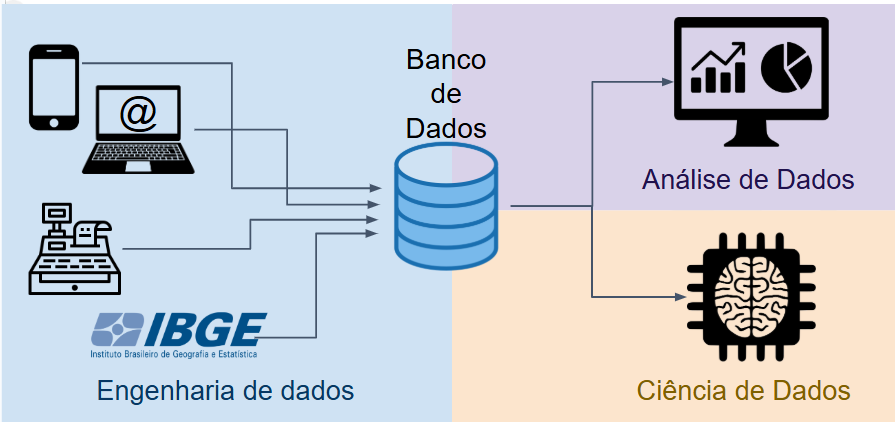
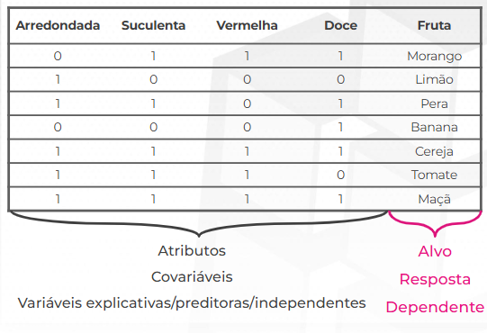

# 🤖 Machine Learning
## O que são dados?
- Unidades de informação que podem ser coletadas, armazenadas, analisadas e interpretadas. 
1. 🔢 Números (int, float, complex)
2. 📝 Textos (string)
3. ✅ Conceitos (boolean)
4. 🖼️ Imagens
5. 🔊 Sons 

## O que é Machine Learning?
- Baseado na *Probabilidade Condicional*, no qual se restringe o espaço amostral de acordo com as novas informações. Há assim um aumento da probabilidade de acerto.

Exemplo:

- Algoritmos de aprendizado de máquina “descobrem” regras com base em exemplos. 

- Só “conhecem” objetos, eventos... que foram apresentados a ele, com uma probabilidade associada.

### Definição:
O aprendizado automático é um subcampo da Engenharia e da Ciência da computação que evoluiu do estudo de reconhecimento de padrões e da teoria do aprendizado computacional em inteligência artificial 

Em 1959, Arthur Samuel definiu aprendizado de máquina como o "campo de estudo que dá aos computadores a habilidade de aprender sem serem explicitamente programados"

## Tipos de aprendizado
### Supervisionado
- O modelo é treinado a partir de um conjunto de dados rotulado, ou seja, dados nos quais já se conhece a resposta correta (ou saída) para cada exemplo.
- Existe um Y

### Não supervisionado
- O modelo é treinado sem receber rótulos nos dados — ou seja, não se sabe a resposta correta. O objetivo é descobrir padrões ocultos, estruturas ou relações nos dados por conta própria.
- Não existe um Y

---
## Modelos de regressão
- Meu Y é um valor numérico (contínuo)

Exemplos:
1) Quantidade de vendas
2) Receita presumida
3) Valor de crédito
4) Precificação de imóvel
5) Volume de chuva

## Modelos de classificação
- Meu Y é uma classe (níveis, rótulos)

Exemplos:
1) Compradores x não compradores
2) Churn x não churn
3) Reconhecimento facial
4) Diagnóstico de câncer
5) Teste de gravidez

