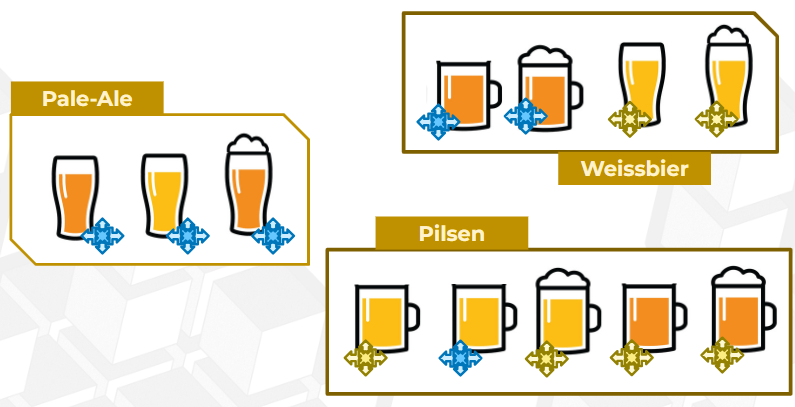
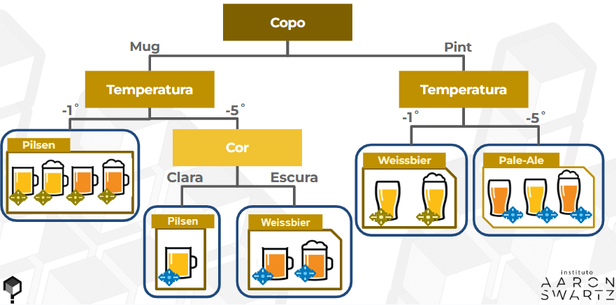
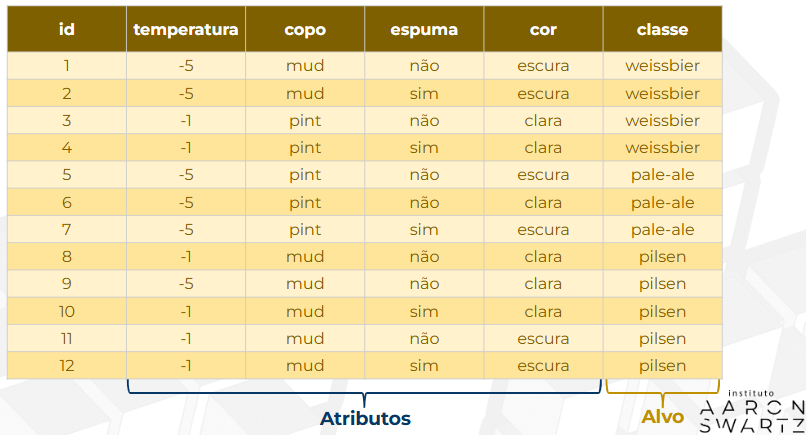

# 🤖 Machine Learning
## Problema das cervejas
Atributos das cervejas:
1) Temperatura
2) Tipo de copo
3) Espuma
4) Cor

### Como separar as cervejas (algoritmo de árvore de decisão)?
- Várias condições que buscam um nó puro na árvore (única classe de variável resposta)

-> Quanto mais profunda a árvore, maior sua pureza, porém menor o número de unidades amostrais (exemplares)

-> Seu objetivo é sempre chegar em nós puros

->  Existem atributos que não foram importantes para o modelo (Ex. espuma). Mas nunca saberemos com certeza isso sem testar

### ✅ Benefícios de remover variáveis irrelevantes para o modelo:
- Redução de ruído: Variáveis sem impacto podem introduzir ruído e confundir o modelo.

- Menor overfitting: Menos variáveis diminuem o risco do modelo se ajustar demais ao conjunto de treino.

- Menor complexidade: Modelos mais simples treinam mais rápido e são mais fáceis de interpretar.

- Melhor generalização: Pode melhorar o desempenho em dados novos.

