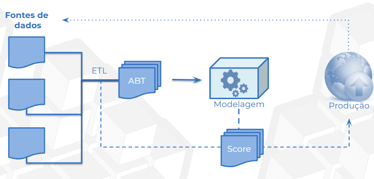

# 🤖 Machine Learning
## Ciclo analítico
- Processo iterativo que descreve todas as etapas necessárias para transformar dados em modelos preditivos acionáveis

### ✅ Parte 01 - obtenção dos dados 
- Fontes de dados (internos ou externos) são obtidos

### ✅ Parte 02 - limpeza e pré-processamento
É realizado o processo de ETL
- Remoção de valores nulos ou tratamento de dados ausentes
- Correção de inconsistências (Ex: padronização de formatos de datas, unidades de medida)
- Conversão de tipos de dados (Ex: transformar "idade" de texto para número)
- Remoção de duplicatas
- Criação de variáveis derivadas (ex: tempo entre eventos, categorização de variáveis contínuas) - feature engineering
- Normalização ou padronização de dados numéricos

### ✅ Parte 03 – Tabela ABT
ABT (Tabela Base Analítica) é a tabela final e consolidada que será usada para treinar os modelos de machine learning
- Seleção das variáveis finais (features + target)
- Junção de diferentes fontes e tabelas (caso necessário)

A granularidade dessa tabela deve se manter (cada linha é uma unidade amostral)

As mesmas variáveis devem ser reproduzidas, ou seja, quando surgir um dado novo, ele deve ter as mesmas features

### ✅ Parte 04 – Análise Exploratória dos Dados 
Explorar os dados com o objetivo de entender padrões, relações, distribuições e possíveis problemas
- 📈 Visualizações gráficas
- 📊 Estatísticas descritivas (média, desvio padrão, mediana, quartis, máximos e mínimos)
- 🔗 Análise de correlação entre variáveis
- 🚨 Identificação de outliers/anomalias
- 🔍 Geração de hipóteses sobre os dados com base nos padrões observados

### ✅ Parte 05 – Modelagem Preditiva
Criar, treinar e ajustar modelos preditivos com base na ABT
- 🔨 Divisão da base ABT em conjuntos de treino e teste (Ex: 60% treino / 20% validação / 20% teste)

- 🤖 Escolha dos algoritmos (Regressão, Classificação, Não supervisionado)

- Ajuste dos  hiperparâmetros - GridSearch

- Treinamento dos modelos, validação dos melhore modelos, teste do melhor modelo

Métricas: 
1. Classificação: Acurácia, Precisão, Recall, F1-score, AUC-ROC
2. Regressão: RMSE, MAE, R²

### ✅ Parte 06 – Validação e Interpretação
Confirmar a qualidade do modelo escolhido, interpretá-lo e entender como ele toma decisões

- 🧪 Validação Final do modelo: 
1) Revalidação no conjunto de teste ou com dados novos (holdout)
2) Validação cruzada (cross-validation) com mais de uma divisão dos dados (ex: K-Fold)
3) Avaliação da generalização do modelo (desempenho em dados fora da amostra)
4) Comparação entre modelos alternativos (se necessário)

- 🔍 Interpretação do Modelo
1) Importância das variáveis (Feature Importance)
2) Análise de erros

- ⚖️ 3. Avaliação de riscos e viés
1) Verificar possíveis vieses algorítmicos (por exemplo, em sexo, idade, região etc.)
2) Garantir equidade e ética na aplicação do modelo
3) Validar se o modelo faz sentido para o negócio ou domínio aplicado

### ✅ Parte 07 – Deploy em Produção
Modelo é aprovado e publicado em ambiente real, onde poderá receber novos dados, gerar previsões e entregar valor ao negócio

- 🚀 Escolha da forma de deploy
1) Batch: o modelo roda periodicamente sobre um lote de dados (ex: previsões diárias, semanais)
2) Real-time / Online: o modelo responde a requisições em tempo real (ex: APIs)
3) Streaming: integração com fluxos contínuos de dados (ex: Kafka, Spark Streaming)

- 🛠 Ferramentas e tecnologias
1) APIs com Flask, FastAPI, Django (em Python)
2) Serviços em nuvem - AWS, Azure ML, Google Cloud AI Platform
3) CI/CD para Machine Learning (MLOps)
4) GitHub Actions, MLflow, DVC, Airflow, Kubeflow...

- 🔁 Integração com sistemas (bancos de dados, dashboards, CRMs, ERPs, apps web ou mobile).Possibilidade de criação de interfaces de input/output para uso do modelo

### ✅ Parte 08 – Monitoramento e Manutenção do Modelo
Monitorar, avaliar e ajustar continuamente o modelo para manter sua performance

- 📉 Monitoramento de performance - métricas de desempenho

- 📦 Monitoramento de dados (Data Drift e Concept Drift)

- 🛠 Reavaliação e re-treinamento do modelo

