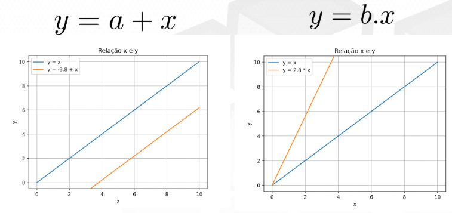
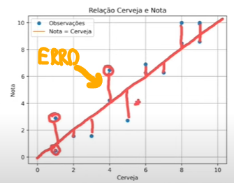
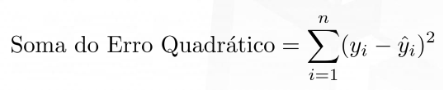
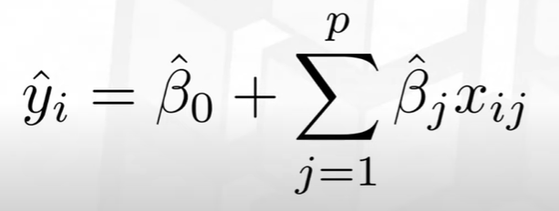

# 🤖 Machine Learning - regressão
## Regressão linear

y = a + bX + ε

1. y = variável dependente (ex: preço da casa)
2. X = variável independente (ex: tamanho da casa)
3. a = intercepto da reta (valor de Y quando X = 0)
4. b = coeficiente angular (quanto Y varia a cada aumento de 1 unidade em X)
5. ε = erro (diferença entre valor previsto e real)

### Qual a melhor reta para representar os dados? (Parâmetros: a = ?, b = ?)
Erro = verdadeiro valor - valor do modelo

-> Para ter Erros positivos, eleva-se ao quadrado

- Temos a soma dos erros quadraticos:

-> Quanto menor a soma, melhor o modelo

- Utilizando mais variáveis:

#### Como minimizar os erros quadráticos?
-> Encontrando os mínimos quadráticos!

