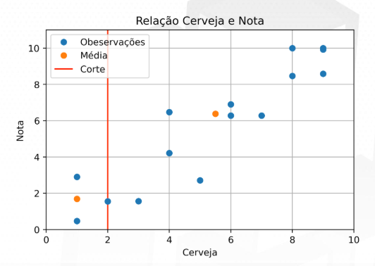
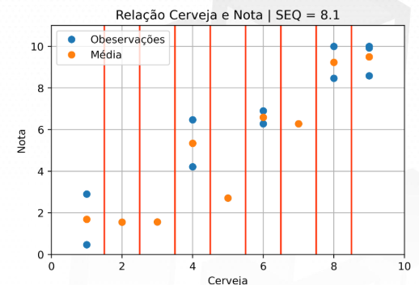
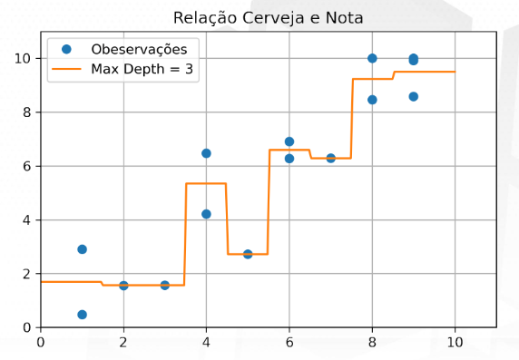

# 🤖 Machine Learning - regressão
## Árvore de decisão
- Vamos escolher um ponte de corte, separar em 2 grupos e calcular a média de cada grupo

-> O melhor ponto de corte é aquele que minimiza o Erro (menor somatorio de todas as distancias)

- Fazemos então, vários pontos de corte:

- A regressão então vai percorrendo cada ponto:

-> Se ele estiver muito concentrado no ponto, significa que temos um overffiting (o modelo se acostumou demais a uma base de dados e não se generaliza)

-> Dessa forma, muitos cortes pode não ser o ideal!
