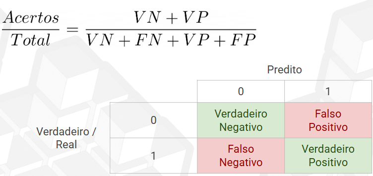
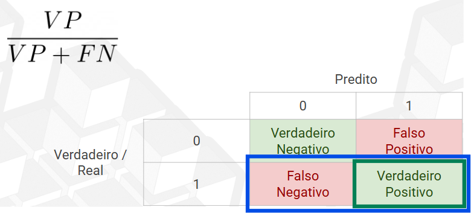
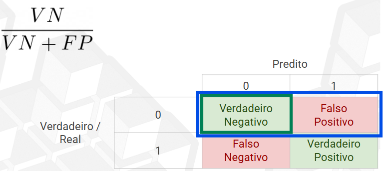
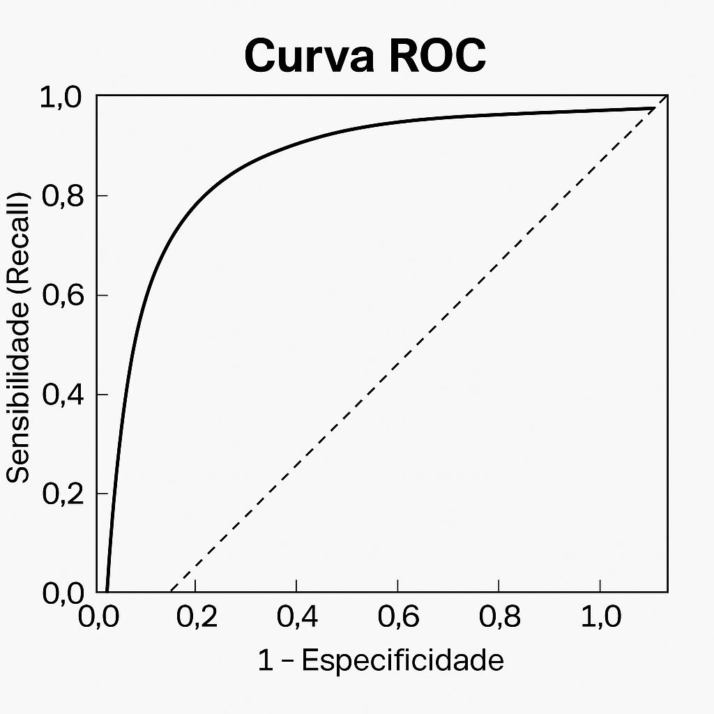
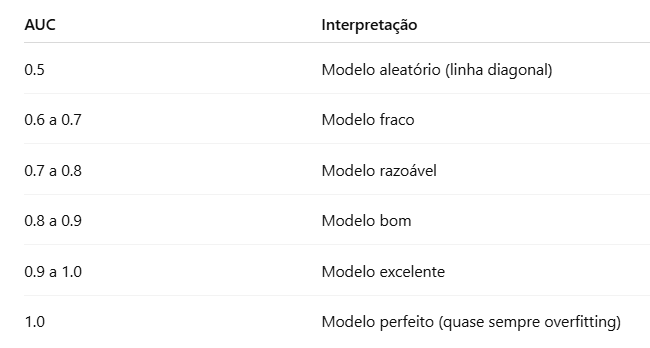

# 🤖 Machine Learning

## ➗ Métricas de performance
### Acurácia

---

### Precisão

---

### Recall (sensibilidade)
- Taxa de captura dos positivos

---

### Especificidade
- Taxa de captura dos negativos (contrário da sensibilidade)

---

## 📈 Curva ROC
A curva ROC (Receiver Operating Characteristic) é um gráfico que mostra a relação entre:

- Taxa de Verdadeiros Positivos (Recall / Sensibilidade)

- Taxa de Falsos Positivos (1 - Especificidade (captura dos negativos))

-> Construída testando o modelo com várias linhas de corte (thresholds) diferentes

-> Quanto maior a área - AUC (Area Under Curve) score, melhor o modelo

### Importância
- A curva mostra o trade-off entre identificar positivos corretamente e não cometer falsos positivos

### 🧪 Exemplo Real
Imagine um modelo que detecta doença cardíaca com base em exames de sangue. 

Temos um dataset com 1.000 pacientes: 200 com doença (positivos), 800 sem doença(negativos)

O modelo retorna a probabilidade de ter a doença (ex: 0.91, 0.67, 0.34...)

Se você escolher threshold = 0.5, classificará:

≥ 0.5 → Doente

< 0.5 → Saudável

Mas será que 0.5 é o melhor corte?
Talvez com 0.4 você identifica mais doentes, mas também comete mais falsos positivos.

### Resolução
- Curva ROC: Cada ponto da curva representa um threshold diferente.

O gráfico mostra como o modelo acerta (TPR - Sensibilidade) e erra (FPR - (1 - Especificidade)) em cada cenário.

A linha diagonal (AUC = 0.5) é o desempenho de um modelo aleatório (tipo jogar uma moeda).

---

Suponha que seu modelo tem AUC = 0.92
- Isso significa que, ao escolher aleatoriamente um paciente doente e um saudável, o modelo tem 92% de chance de atribuir maior probabilidade ao doente.

Logo, o modelo é excelente!

---

### A curva ROC me mostra qual a melhor linha de corte?
A curva ROC por si só não mostra diretamente qual é a melhor linha de corte (threshold).

Ela mostra como o desempenho do modelo muda conforme o threshold varia — mas não escolhe um threshold ótimo automaticamente.

#### ✅ O que a curva ROC mostra?
A performance global do modelo em classificar corretamente positivos e negativos.

O trade-off entre sensibilidade (recall) e especificidade.

AUC: qualidade geral do modelo independente do corte.

### 🔎 Como escolher a melhor linha de corte?

