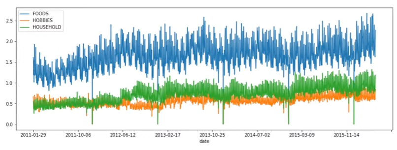
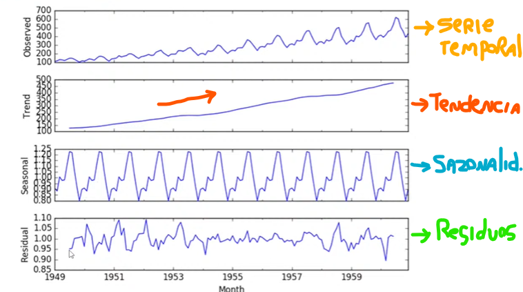
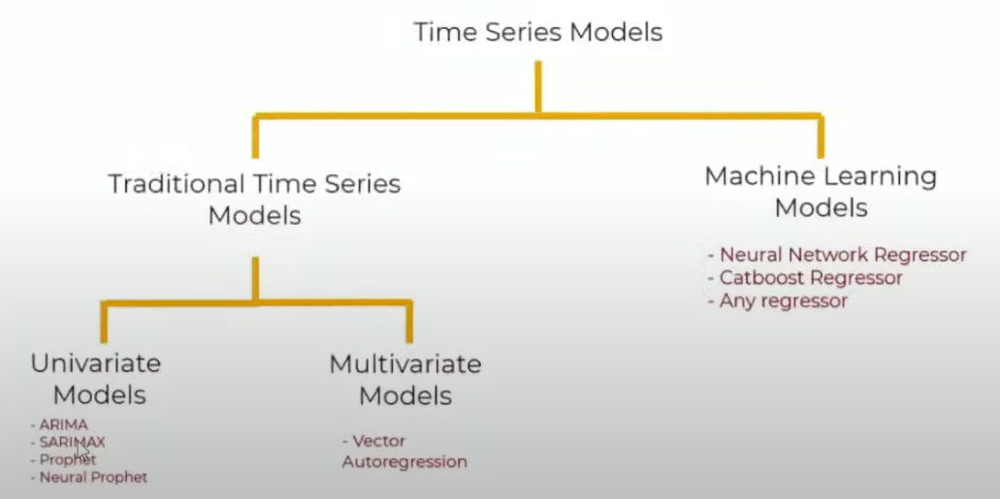
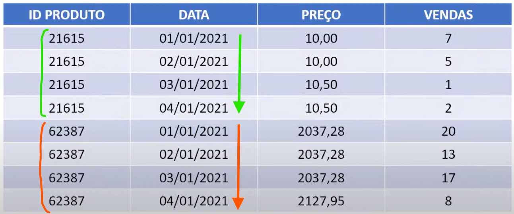
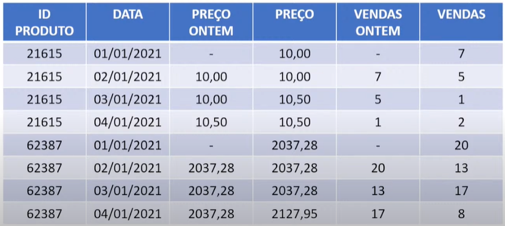

# 🤖🤖 Machine Learning
## O que são Séries Temporais?
- Informações registradas em intervalos de tempo (não trabalho com um único período)
- Possui tendências e sazonalidades (informações temporais)

Exemplo:
1. Registros de temperatura durante períodos de tempo
2. Volumes de saída de estoque de produtos durante meses
3. Quantidades de algo desde uma determinada data

## Porque são tão diferentes de regressões?
- Regressão -> tentar prever dentro de um limite (interpolação)
- Séries temporais -> tetar prever fora de um limite (extrapolação)

### Problemas a serem resovidos
- Quantos produtos vamos vender amanhã? E na próxima semana?
- Quantos casos de COVID-19 o estado do CE terá no próximo mês?
- Qual o consumo de energia de uma cidade no próximo semestre?
- Quantos turistas visitarão o RJ no próximo verão?

## 💻🎲 Análise Exploratória de Dados (EDA)
- Visualizar os dados a fim de obter informações, perspectivas, padrões visuais...

## 💻🔮 Forecasting
- Encontrar padrões e tendências para tentar prever eventos futuros com base no histórico de dados no tempo
- Semelhante à análise supervisionada tradicional, mas incluindo a variável temporal

1. Tendência = direção da série (subindo, descendo)
2. Sazonalidade = características e padrões que podem se repetir no tempo

| **Características**                             | **Tradicionais**                                                                 | **Machine Learning**                                                                 |
|--------------------------------------------------|----------------------------------------------------------------------------------|--------------------------------------------------------------------------------------|
| **Previsão em múltiplos períodos**              | Não permite predição em períodos mais à frente (uma predição atrás da outra)   | Permite fazer predição diretamente (para daqui a 1, 10 ou 20 dias, por exemplo)     |
| **Reutilização do modelo para outros dias**     | Modelo para amanhã está pronto para predizer o depois de amanhã                 | Modelos diferentes, treinar tudo de novo (1 modelo para 1 dia, outro para 2 dias)   |
| **Dificuldade de ajuste (tuning)**              | Difícil de "tunar", precisa conhecer mais a fundo sobre séries temporais        | Mais fácil acertar                                                                   |
| **Atributos variáveis no tempo**                | Não pode adicionar atributos que variam no tempo                                | Pode adicionar atributos que variam no tempo                                         |

## ARIMA
- AR = Autoregression (utiliza valores numéricos históricos para prever os futuros (lag))
- I = Integrated (técnica para remover a tendência na série temporal e facilitar a análise - tornar a série estacionária)
- MA = Moving Average (usa erros residuais a partir da média móvel)
- Criação de features "autorregressivas" (valores históricos, máximo, mínimo, média) -> dessa forma, eu trago a temporalidade
- Com essa modelagem, é possível utilizar quaisquer modelos, mas o mais utilizado é o XGBoost (eXtreme Gradient Boosting)

## Como transformar um problema de séries temporais em uma regressão?
- Utilizar variáveis desafasadas no tempo (Lagged Variables) -> queremos prever, mas do passado

- Queremos prever as vendas! 
- Precisamos entender o que podemos saber hoje para prever amanhã (features):
1. Preços passados
2. Vendas passadas

