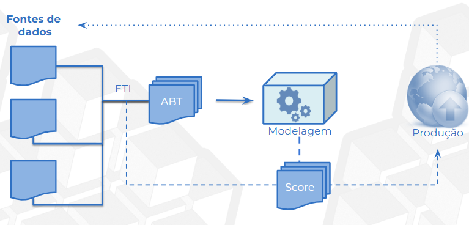

# 🤖 Machine Learning
## Ciclo analítico
- Processo iterativo que descreve todas as etapas necessárias para transformar dados em modelos preditivos acionáveis

### Parte 01: 
Fontes de dados (internos ou externos) são extraídas, tratadas e transformadas em uma *tabela ABT* (Analytical Base Table)

-> A granularidade dessa tabela deve se manter (cada linha é uma unidade amostral)

### Parte 02: 
A ABT será usada como input para o modelo (modelagem)

-> As mesmas variáveis devem ser reproduzidas, ou seja, quando surgir um dado novo, ele deve ter as mesmas features

