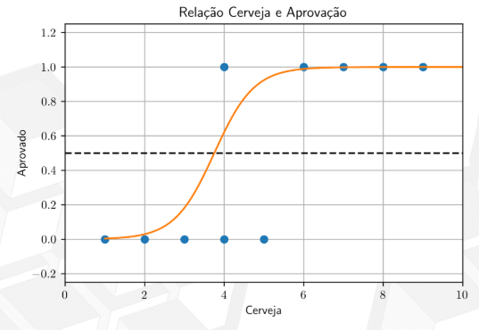
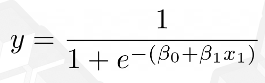
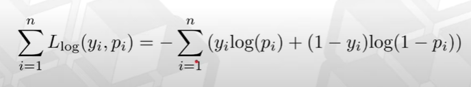
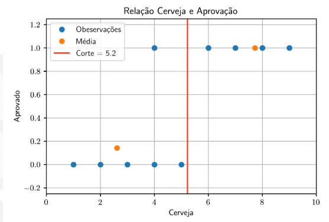
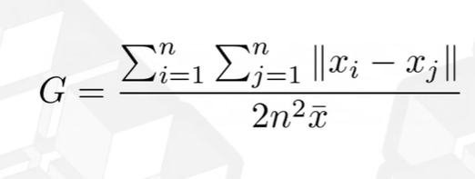
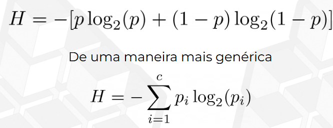
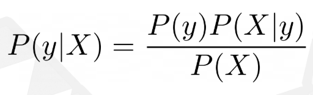
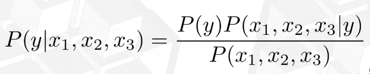

# 🤖 Machine Learning - classificação
Quero rotular, não inferir um número, mas sim uma classe

## 📈 Regressão Logística
- Não tenho mais uma relação linear, pois agora é sim ou não
- Uma melhor forma de representar seria uma curva

-> Preciso agora encontrar o β0 e o β1

-> Os dados que ditam o modelo (modelo se ajusta aos dados)

-> A linha tracejada dita o corte, acima desse limite a classificação muda. Posso alterar o ponto de corte caso eu queria acertar mais uma determinada classe (maior importância)

#### Evitando erros
- Não utilizamos aqui os Erros quadráticos, mas sim o Log Loss para inferir o erro

Soma do Log Loss:

---
## 🌳 Árvore de decissão para classificação
- A ideia é a mesma para a regressão -> verificar diversos pontos de corte para tentar separar entre aprovado e não aprovado

- Não podemos utilizar a Soma dos erros quadráticos, iremos aplicar o coeficiente de Gini (pureza do nó)

-> Se todos os nós forem puros: Gini = 0 (menos desigual)

- Existem outras medidas, como a entropia:

-> Avalia a proporção de eventos de uma classe dentro do nó

## 🧮 Naive Bayes
- Modelo baseado no Teorema de Bayes
- Assume independência condicional entre as variáveis preditoras
- Existem diferentes variações do Naive Bayes, dependendo da distribuição assumida para os dados:
1. Gaussian Naive Bayes: assume distribuição normal para as variáveis contínuas
2. Multinomial Naive Bayes: usado para dados discretos como contagens (ex: classificação de texto)
3. Bernoulli Naive Bayes: usado para variáveis binárias (ex: presença ou ausência de uma palavra)

-> Ao usar variaveis com outras distribuições não seria ideal aplicar Naive Bayes

-> Probabilidade da condição existir ou não, com base em uma série de caracteristicas - P(y|X)

