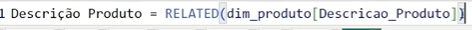
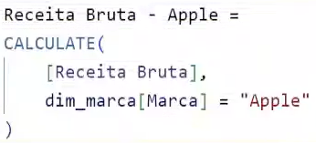

# 🔢 Linguagem DAX

## 🧱 Colunas (Calculadas)
Calculadas linha a linha dentro de uma tabela e armazenadas no modelo de dados. Elas existem como campos físicos no dataset.

#### ✅ Usos:
- Criar novas informações a partir de colunas existentes.
- Categorizar dados, criar segmentações ou eixos de gráfico.

#### Exemplo: 
- Calcular a margem de lucro por venda

Margem = Vendas[Preço] - Vendas[Custo]

## 📊 Medidas
Cálculos agregados que são avaliados no momento da visualização, com base nos filtros do relatório.

#### ✅ Usos:
- Somar, contar, calcular médias, porcentagens, etc.
- Usadas para métricas que mudam dependendo do contexto (filtro, segmentação, etc).
- Muito mais leves no desempenho do modelo.

#### Exemplo: 
Total Vendas = SUM(Vendas[Valor])

---

### 1. RELATED (PROCV)
Nova coluna = RELATED(tabela[infomação])

- Antes do colchete é o nome da tabela
- Dentro do colchete é o nome da coluna

- Só consegue trazer informações de tabelas com relação

---

### 2. CALCULATE
Alteração do contexto de filtro ou de resultados de tabela

Exemplo: Apenas o valor de receita bruta da Apple, não quero dos outros fornecedores

- O que irá filtrar
- O tipo que irá filtrar
