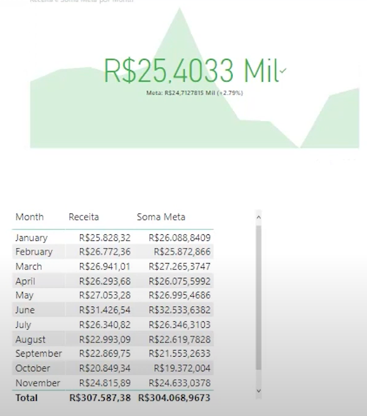

# Tutorial sobre Power BI - parte 01
## 📊 O que é BI?
- Business Intelligence (BI) é o processo de transformar dados brutos em informações acionáveis que ajudam as empresas a tomar melhores decisões.
- "A inteligência dos negócios"

## ⚙️ Partes principais:
- DESKTOP - versão gratuita e local do software, onde serão criados os dashboards e relatórios
- SERVICE - serviço de nuvem do software, onde serão compartilhados os dashboards e relatórios
- MOBILE - serviço mobile do software, onde serão compartilhados os dashboards e relatórios

## 📥 Inserção de dados:
- Os dados podem ser inseridos de diversas formas, o que inclui tanto arquivos, bancos de dados e serviços em nuvem

## 🔗 Relações:
- Uma relação entre tabelas em Power BI é um vínculo entre duas tabelas com base em uma ou mais colunas (normalmente chaves primárias e estrangeiras), permitindo que os dados se comuniquem entre si
- Pode ser acessado em "Modelo" e criado simplemente arrastando o campo em comum (chave) para a planilha que receberá a relação

## 🔄 Power Query - ETL:
- Power Query é uma ferramenta de extração, transformação e carregamento de dados (ETL) integrada ao Power BI, Excel e outras plataformas Microsoft, usada para conectar, limpar, transformar e combinar dados de forma visual e automatizada — sem necessidade de programação avançada
- Basta ir na guia superior em "Pagina inicial" -> "Transformar dados"
- Para ser possível alterar os valores, é necessário seguir determinandos passos: ir em "transformar" ou "adicionar coluna" -> É possível fazer substituições de valores, alterar tipos de dados, semelhante ao Excel

## ---

## ➕ DAX: Criando colunas
- Passo 01: Ir até a guia Modelagem no Power BI Desktop
- Passo 02: Clicar em Nova Coluna
- Passo 03: Digitar a fórmula:
```
coluna_new = tabela[coluna_old] * 100
```
- Depois disso, o Power BI adicionará a nova coluna (coluna_new) à tabela especificada.

### Operadores:
| Operador | Função         | Exemplo                   |
|----------|----------------|---------------------------|
| `+`      | Adição         | `[Lucro] + 100`           |
| `-`      | Subtração      | `[Vendas] - [Custos]`     |
| `*`      | Multiplicação  | `[Quantidade] * [Preço]`  |
| `/`      | Divisão        | `[Total] / [Qtd]`         |
| `^`      | Potência       | `2 ^ 3 = 8`               |

## 🧮 DAX: Criando medidas
- Passo 01: Vá na guia Modelagem no Power BI Desktop.
- Passo 02: Clique em Nova Medida.
- Passo 03: Digite a fórmula no editor DAX com a seguinte estrutura:
```
Total faturamento = SUM(Vendas[Total])
```
```
Total absoluto = CALCULATE([Total faturamento ]; ALL(Vendas))
```
```
% Total Geral = [Total faturamento ]/[Total absoluto]
```
- Essa medida não cria uma nova coluna, mas pode ser usada em gráficos, cartões, tabelas e outras visualizações para mostrar o total somado dinamicamente, com base nos filtros aplicados.

## 🔁 DAX: Funções iterantes (formula + X)
### SUMX:
```
Total faturamento = SUMX(Vendas, Vendas[Preço Unitário]*Vendas[Quantidade])
```


## ---

## CRIANDO UM RELATÓRIO PROFISSIONAL
### Passo 01 - Definir uma linha lógica
- Plano de fundo -> Segundo plano da página -> Inserir um draft

### Passo 02 - Adicionar, cartões, botões, tabelas e gráficos


### Passo 03 - Criar linhas do tempo e segmentar dados com SLICERS
- Filtragem dos dados de forma dinâmica


### Passo 04 - KPIs
#### Principais:
 - Margem líquida
 - Análise horizontal
 - Análise vertical
 - Necessidade de Capital de Giro (NCG)
 - Inadimplência
 - Margem de contribuição individual
 - Ponto de equilíbrio

 #### Como acessa-los:
 - Na direita, existe a opção KPI
 
