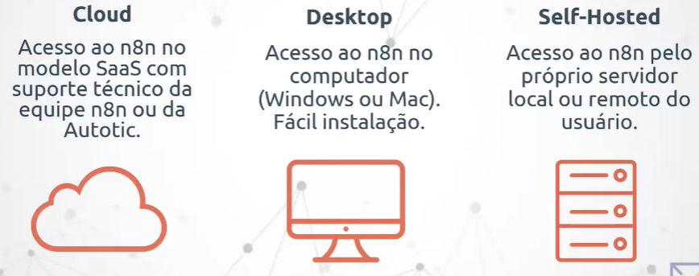
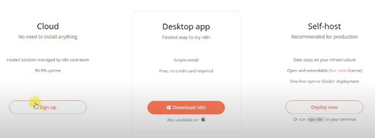

# 👨‍💻 N8N - n-eight-n
Ferramenta de automação de fluxos de trabalho (workflow automation) de código aberto (open source).

Permite conectar diferentes aplicações e serviços entre si, criando automações sem necessidade de programar (low-code), mas também com suporte a código personalizado quando necessário.

- Não é Open Source, mas sim Código Justo (pode instalar, mas sem customização para fins de revenda)

## ☁️ Ipaas
- Plataforma de integração em nuvem (cloud - low code)
- Acesso a uma interface para informação dos parâmetros 
- O objetivo principal é fazer a integação entre aplicações web para ajudar a acelerar e diminuir custos

#### Por que adotar?
- Automação de processos de forma simples e rápida

Exemplo: Setor comercial precisa ser notificado a cada falha em determinado processo de transação de venda.

## Vantagens
- Praticidade: integração com poucos cliques
- Documentação: atualizada e de escrita simples
- Atualizações: novas melhorias e integrações constantes
- Custo x Benefícios: gratuito e sem limites de uso
- Comunidade: ativa e colaborativa

## Versões

